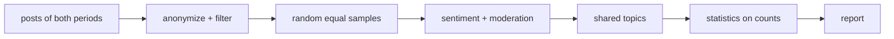
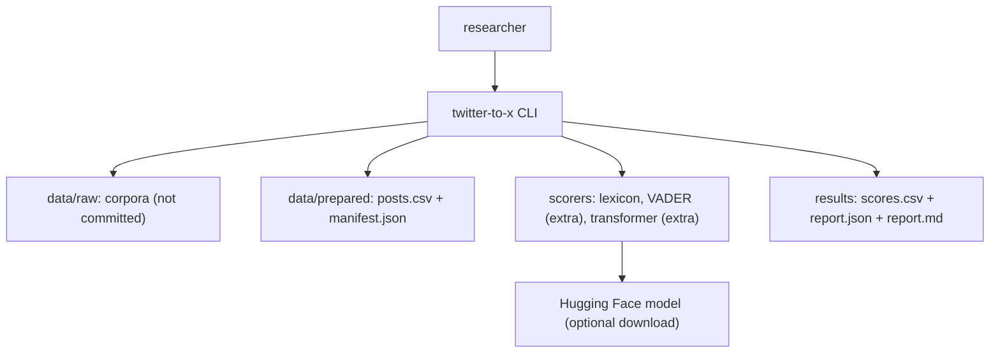
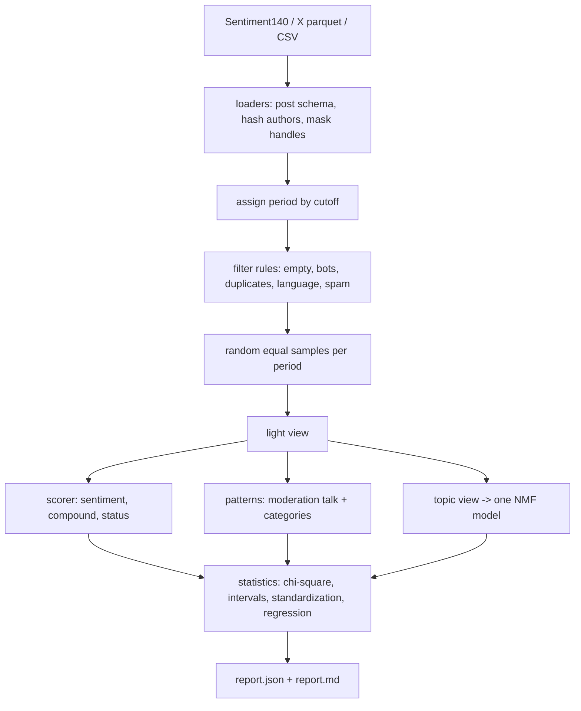

<div align="center">

# twitter-to-x — A Sound Before-And-After Study Of Sentiment And Moderation Talk

**twitter-to-x is a comparative study pipeline for social-media posts. It takes posts from before and after the platform change through these steps to a report with counts, effect sizes and intervals:**

`load + anonymize` → `filter by rules` → `random equal samples` → `score sentiment` → `flag moderation talk` → `shared topics` → `statistics on counts`.


**[Summary](#1-summary)** ·
**[Workflow](#4-the-end-to-end-workflow)** ·
**[Run it](#10-how-to-run-twitter-to-x)** ·
**[Configuration](#104-environment-variables)** ·
**[Known problems](#13-known-problems)** ·
**[Glossary](#15-glossary)**

</div>

> [!NOTE]
> This README uses ASD-STE100 Simplified Technical English. The writing rules and the project
> vocabulary are in [`docs/ste-style-guide.md`](docs/ste-style-guide.md). Each term in the
> [Glossary](#15-glossary) has only one meaning.

> [!WARNING]
> Do not use twitter-to-x to moderate content or to judge a person. It is a descriptive research tool.
> The patterns and the scorers make errors, and the corpora carry the bias of their collection. A person
> must review each conclusion before you publish it.

---

twitter-to-x asks one question: did sentiment and talk about content moderation change after Twitter became X? The main idea is that a fair comparison needs a fair design. Both periods get random samples of the same size, the same filter rules and the same scorers. The sentiment scorers read text that still has its negations. The moderation patterns have word boundaries and a check set. The statistics use counts, effect sizes, intervals and a topic adjustment.

This README is the **one location that explains all of twitter-to-x**. It gives these topics:

- the general design
- each component and its procedure, step by step
- the decision rules
- the data map
- the runbook
- the validation results and the known problems

| If you are… | Read |
|---|---|
| A manager or reviewer | [1](#1-summary), [3](#3-design-rules), [4](#4-the-end-to-end-workflow), [12](#12-validation-results), [14](#14-key-points) |
| A developer who joins the project | All sections, in sequence. Keep [10](#10-how-to-run-twitter-to-x) and [13](#13-known-problems) open while you work |
| An operator who runs twitter-to-x | [10](#10-how-to-run-twitter-to-x), then the section for the component that you use |

---

## Table of contents

1. 🧭 [Summary](#1-summary)
2. 🏗️ [How twitter-to-x is built](#2-how-twitter-to-x-is-built)
   - 2.1 [Components](#21-components)
   - 2.2 [System context](#22-system-context)
   - 2.3 [Repository layout](#23-repository-layout)
3. 🛡️ [Design rules](#3-design-rules)
4. 🔄 [The end-to-end workflow](#4-the-end-to-end-workflow)
   - 4.1 [Full flow](#41-full-flow)
   - 4.2 [The life cycle of one post](#42-the-life-cycle-of-one-post)
5. 🔵 [Data preparation](#5-data-preparation)
6. 🟢 [Sentiment scorers](#6-sentiment-scorers)
7. 🟣 [Moderation patterns and topics](#7-moderation-patterns-and-topics)
8. ⚖️ [The statistics](#8-the-statistics)
9. 🗂️ [Data and file map](#9-data-and-file-map)
10. ▶️ [How to run twitter-to-x](#10-how-to-run-twitter-to-x)
    - 10.1 [Prerequisites](#101-prerequisites) · 10.2 [Installation](#102-installation) · 10.3 [Run twitter-to-x](#103-run-twitter-to-x) · 10.4 [Environment variables](#104-environment-variables)
11. 🧩 [How to extend twitter-to-x](#11-how-to-extend-twitter-to-x)
12. ✅ [Validation results](#12-validation-results)
13. ⚠️ [Known problems](#13-known-problems)
14. 📌 [Key points](#14-key-points)
15. 📖 [Glossary](#15-glossary)
16. 📄 [License](#16-license)

---

## 1. Summary

**The problem.** A before-and-after comparison of two corpora is easy to compute and easy to get wrong. The difficult questions are:

- Is each sample random, or is it a slice of a file that is sorted by label?
- Does the chi-square test get counts, or proportions?
- Does the sentiment scorer see "not", or did the cleaning remove it?
- Does "ban" match "urban" and "banana"?
- Is a change in sentiment a platform effect, or a change in topics, era and collection?
- Are scorer errors counted as a sentiment?

twitter-to-x gives each of these questions its own component and its own tests.

| Item | Value |
|---|---|
| Input | Posts from Sentiment140, a public X dataset chunk, or your own CSV with timestamps |
| Output | `posts.csv` and `manifest.json` (prepared sample), `scores.csv` (no text), `report.json`, `report.md` |
| Components | **6**: data preparation, sentiment scorers, moderation patterns, topics, statistics, report |
| Providers | Hugging Face Transformers (`transformer` scorer), vaderSentiment (`vader` scorer). Both optional |
| Offline mode | Synthetic posts with a known truth, the lexicon scorer, the patterns, NMF topics, all statistics |
| Safety | Hashed authors, masked handles, no text in score files, rules instead of manual removal |
| Tests | **30** unit tests (`pytest`). All 30 run in CI with no optional extra |



---

## 2. How twitter-to-x is built

### 2.1 Components

| Component | Module | Purpose |
|---|---|---|
| Settings | `src/twitter_to_x/config.py` | Settings from environment variables, the default cutoff |
| Loaders | `src/twitter_to_x/data/sources.py` | Sentiment140, X parquet, CSV. Post schema. Period assignment |
| Privacy | `src/twitter_to_x/data/anonymize.py` | Salted author hash, masked handles and links |
| Filter rules | `src/twitter_to_x/data/filters.py` | Named rules with counts per period |
| Sampling | `src/twitter_to_x/data/sampling.py` | Random equal samples, stratification, sortedness check |
| Synthetic posts | `src/twitter_to_x/data/synthetic.py` | Posts with known effects, traps and spam |
| Text views | `src/twitter_to_x/text.py` | Light view for sentiment, topic view for topics |
| Scorers | `src/twitter_to_x/sentiment/` | Lexicon (offline), VADER adapter, batched transformer |
| Patterns | `src/twitter_to_x/moderation/detector.py` | Word-boundary patterns in four categories |
| Pattern check | `src/twitter_to_x/moderation/validate.py`, `gold.csv` | Precision, recall and Wilson intervals |
| Topics | `src/twitter_to_x/topics.py` | One NMF model for both periods, prevalence intervals |
| Statistics | `src/twitter_to_x/stats.py` | Chi-square on counts, Cramér's V, intervals, standardization, logistic regression |
| Study | `src/twitter_to_x/analysis.py` | Prepare, score, analyze, report |
| CLI | `src/twitter_to_x/cli.py` | The `twitter-to-x` command |

### 2.2 System context



### 2.3 Repository layout

```
twitter-to-x/
├── data/README.md               sources, design advice, privacy, file schema
├── docs/ste-style-guide.md      writing rules and project vocabulary
├── src/twitter_to_x/
│   ├── data/                    loaders, anonymization, filter rules, sampling, synthetic posts
│   ├── sentiment/               scorer interface, lexicon and VADER, transformer
│   ├── moderation/              patterns, validation, check set (gold.csv)
│   ├── text.py                  light view and topic view
│   ├── topics.py                shared NMF topics
│   ├── stats.py                 tests, intervals, standardization, regression
│   ├── analysis.py              prepare, score, analyze, report
│   ├── config.py                settings
│   └── cli.py                   the twitter-to-x command
├── tests/                       pytest suite
└── pyproject.toml               package, extras and the console script
```

---

## 3. Design rules

### 3.1 Random samples only
`sample_period` and `balanced_periods` draw at random, without replacement, with the same size per period. No code takes the head or the tail of a file. `sortedness` measures how sorted a column is, and the manifest records it for Sentiment140 labels.

### 3.2 Counts into the chi-square test
`contingency` makes an integer table. `chi_square` refuses a table with fractions and reports Cramér's V next to the p-value.

### 3.3 Sentiment on the light view
The scorers read the light view: handles and links masked, nothing else changed. Stop-word removal and lower case exist only in the topic view.

### 3.4 Patterns with word boundaries
Every moderation pattern has `\b` boundaries and explicit word forms. Generic words such as "removed" count only after "tweet", "post" or "account". A labelled check set measures precision and recall.

### 3.5 One pipeline for both periods
Both periods go through the same loader, filter rules, sample size and scorer, one time each. Each filter rule reports its removals per period.

### 3.6 Confounders are measured
The report gives standardized mean differences for length, links, mentions and hashtags. It gives the crude and the topic-adjusted sentiment difference. The regression controls for the topic.

### 3.7 Errors are not a sentiment
A scorer error gets `status = error` and no sentiment. The report counts errors per period and excludes them.

### 3.8 Privacy by default
The loaders hash authors with a salt and mask handles. `scores.csv` has no text column. No data file is in the repository.

---

## 4. The end-to-end workflow

### 4.1 Full flow



### 4.2 The life cycle of one post

1. The loader reads the post, hashes the author and masks the handles in the text.
2. The loader parses the timestamp to UTC and gives the post a period.
3. The filter rules check the post. A removed post adds one to the count of its rule.
4. The sampler draws the post into the sample of its period, or not.
5. The light view masks links and decodes HTML entities.
6. The scorer gives the post a sentiment, a compound value and a status.
7. The patterns flag the post as moderation talk or not, with its categories.
8. The topic model gives the post its dominant topic.
9. The statistics count the post in the tables of its period.

---

## 5. Data preparation

**Purpose.** Give both periods comparable, anonymized, rule-filtered samples.

| Input | Output |
|---|---|
| `KIND=PATH` sources | `posts.csv` and `manifest.json` |

**Procedure**

1. Load each source into the post schema: `post_id, text, created_at, source, author_hash`.
2. Check that each post has text, a valid timestamp and a unique id.
3. Give each post the period `pre` or `post` from the cutoff.
4. Apply the filter rules in this order: `empty`, `repeated_author_text`, `duplicate_text`, `not_english`, `spam_pattern`.
5. Draw a random sample of the same size from each period.
6. Make the light view of each text.
7. Write the posts and the manifest.

| Filter rule | Removes |
|---|---|
| `empty` | Posts with no word characters |
| `repeated_author_text` | All copies when one author posts the same text more than 3 times (bot signal) |
| `duplicate_text` | Later copies of the same normalized text |
| `not_english` | Posts with less than 80 % Latin letters or with no common English word |
| `spam_pattern` | Giveaway and follow-back patterns, 6 or more hashtags, 3 or more links |

---

## 6. Sentiment scorers

**Purpose.** Give each post a sentiment from the light view, with the same scorer for both periods.

| Scorer | Method | Extra |
|---|---|---|
| `lexicon` | 69 word valences, negation (-0.74) in a 3-word window, intensifiers (x1.3), capitals (x1.5), "but" weighting, "!" emphasis | none |
| `vader` | The `vaderSentiment` analyzer, compound score | `vader` |
| `transformer` | `TTX_SENTIMENT_MODEL` in batches of `TTX_BATCH_SIZE`, labels from the model's `id2label` | `hf` |

**Rules**

- The compound threshold for `lexicon` and `vader` is ±0.05.
- The transformer compound is `p(positive) - p(negative)`.
- `LABEL_0`, `LABEL_1` and `LABEL_2` map to negative, neutral and positive.
- A failed batch gets `status = error` for each post in it.

---

## 7. Moderation patterns and topics

**Purpose.** Find moderation talk with known precision, and describe topics in one space for both periods.

| Category | Examples of matched forms |
|---|---|
| `account_action` | suspended, suspensions, shadowbanned, banned, deplatformed, reinstated, account was locked |
| `content_action` | community notes, fact-checked, labeled as misleading, post was removed, taken down |
| `policy_and_speech` | free speech, censorship, content moderation, moderation rules, moderators, hate speech, misinformation |
| `verification` | blue checks, verification, paid verification |

**Topic procedure**

1. Make the topic view: lower case, content words, no stop words.
2. Fit one TF-IDF (1-2 grams, `min_df` 2, `max_df` 0.5) and one NMF model on the posts of BOTH periods.
3. Give each post its dominant topic.
4. Compute the share of each topic per period and a bootstrap interval of the difference.

**Rules**

- Because one model covers both periods, topic k has the same meaning in `pre` and `post`.
- The NMF seed is `TTX_SEED`, so a run is reproducible.

---

## 8. The statistics

| Output | Method |
|---|---|
| Sentiment shares | Count and share per period, Wilson 95 % interval |
| Sentiment by period test | Chi-square on the counts table (no continuity correction), Cramér's V, smallest expected count |
| Moderation share change | Difference of proportions, Newcombe 95 % interval |
| Negative share in moderation talk | Same, inside the moderation-talk posts. Chi-square on counts |
| Topic-adjusted difference | Direct standardization on the topic with pooled weights, bootstrap 95 % interval |
| Regression | Logistic: negative ~ post + moderation + post × moderation + topic dummies. Odds ratios, Wald 95 % intervals |
| Confounder check | Standardized mean difference post vs pre: length, links, mentions, hashtags |
| Check against truth | Only for synthetic posts: pattern precision and recall, scorer accuracy |

---

## 9. Data and file map

| Path | Committed? | Contents |
|---|---|---|
| `data/README.md` | Yes | Sources, design advice, privacy, file schema |
| `src/twitter_to_x/moderation/gold.csv` | Yes | 60 hand-written check sentences (no real posts) |
| `data/raw/` | No (git ignores it) | Corpora or synthetic posts |
| `data/prepared/posts.csv` | No (git ignores it) | The anonymized, filtered, sampled posts |
| `data/prepared/manifest.json` | No (git ignores it) | Cutoff, seed, counts, date ranges, filter counts |
| `results/<scorer>/scores.csv` | No (git ignores it) | Scores and flags per post, no text |
| `results/<scorer>/report.json`, `report.md` | No (git ignores it) | The study report |
| `.env.example` | Yes | Variable names only |

---

## 10. How to run twitter-to-x

### 10.1 Prerequisites

| Need | For |
|---|---|
| Python 3.11+ | All components |
| `vaderSentiment` (extra `vader`) | The `vader` scorer |
| `torch` and `transformers` (extra `hf`) | The `transformer` scorer |
| `pyarrow` (extra `parquet`) | The `x_parquet` loader |
| A GPU | Recommended for the transformer on large samples |

### 10.2 Installation

```bash
git clone https://github.com/KrishnaAnnavaram/twitter-to-x.git
cd twitter-to-x
python -m venv .venv
. .venv/bin/activate            # Windows: .venv\Scripts\activate
pip install -e ".[dev]"         # core + tests
pip install -e ".[all]"         # optional: VADER, transformer, parquet
```

### 10.3 Run twitter-to-x

```bash
# 1. offline demo: synthetic posts with known effects, lexicon scorer, full report
twitter-to-x demo

# 2. real data (see data/README.md)
export TTX_SALT=<a long random secret>        # keep it out of the repository
twitter-to-x prepare --source csv=data/raw/pre_2021_2022.csv --source csv=data/raw/post_2023_2024.csv \
                     --n-per-period 20000
twitter-to-x analyze --scorer lexicon
twitter-to-x analyze --scorer transformer      # needs the hf extra
twitter-to-x validate-moderation --gold data/raw/my_labelled_sample.csv
twitter-to-x flag "my account got suspended" "urban gardening tips"
```

`python -m twitter_to_x` is the same as the `twitter-to-x` command.

### 10.4 Environment variables

| Variable | Used by | Meaning |
|---|---|---|
| `TTX_DATA_DIR` | CLI | Base folder for `raw/` and `prepared/`. Default `data` |
| `TTX_OUT_DIR` | CLI | Folder for the results. Default `results` |
| `TTX_SEED` | Sampling, topics, bootstrap | Default `7` |
| `TTX_CUTOFF` | Period assignment | ISO date. Default `2022-10-27` |
| `TTX_SALT` | Author hash | Secret salt. Empty: a new random salt for each run |
| `TTX_SENTIMENT_MODEL` | `transformer` scorer | Default `cardiffnlp/twitter-roberta-base-sentiment-latest` |
| `TTX_BATCH_SIZE` | `transformer` scorer | Posts per batch. Default `64` |
| `TTX_HF_OFFLINE` | `transformer` scorer | `1` loads the model from the local cache only |

Keep `TTX_SALT` only in a local `.env` file. Git ignores this file. Do not print or commit the salt.

---

## 11. How to extend twitter-to-x

| You want to… | Do this | Code change? |
|---|---|---|
| Use another cutoff (the rename to X) | Set `TTX_CUTOFF=2023-07-24` | No |
| Add a moderation pattern | Add it to `CATEGORIES` and add check sentences to your gold file | Small |
| Use your own labelled check set | `validate-moderation --gold <file>` with `text,label` | No |
| Add a scorer | Implement `score(texts) -> DataFrame` and add it to `build_scorer` | Small |
| Add a source | Write a loader that returns the post schema and add it to `LOADERS` | Small |
| Use BERTopic | Replace `TopicModel` with a model that is fit on both periods together | Yes |

---

## 12. Validation results

| Validation | Result | Command |
|---|---|---|
| Unit tests (CI installs only `.[dev]`) | **30 passed**, 0 skipped. No test needs an optional extra | `pytest -q` |
| Patterns on the check set (60 sentences) | Precision 0.903 (Wilson 0.751 – 0.967), recall 1.000 (0.879 – 1.000), F1 0.949 | `twitter-to-x validate-moderation` |
| Substring baseline on the check set | Precision 0.382, recall 0.464, F1 0.419 | `twitter-to-x validate-moderation` |
| Offline demo (synthetic posts) | See the table below | `twitter-to-x demo` |

The patterns give three false positives. They are "my cat banned me from the sofa", "the bus was suspended because of snow" and "the ban on plastic bags". The check set and the patterns were written together, so these values are an optimistic smoke check, not an estimate for real posts.

Offline demo on **synthetic posts**, 3000 per period before the filters, 2841 per period after the filters and the sampling:

| Quantity | Result | Built-in truth |
|---|---|---|
| Filter removals | 120 bot copies, 144 duplicates, 54 non-English | 60 spam copies per period |
| Moderation talk share | pre 0.032, post 0.068, difference +0.036 (0.025 to 0.047) | more in `post` |
| Negative share in moderation talk | pre 0.433, post 0.646, difference +0.212 (0.088 to 0.329) | 0.45 → 0.65 |
| Negative share, all posts | crude +0.069, topic-adjusted +0.034 (0.012 to 0.058) | part of the change is the topic mix |
| Sentiment by period | chi2 = 37.6, dof 2, p < 0.001, Cramér's V = 0.081 | small effect |
| Regression, `post_x_moderation` | odds ratio 2.38 (1.40 – 4.06) | positive interaction |
| Patterns against the truth | precision 1.000, recall 0.950 | - |
| Lexicon scorer against the truth | accuracy 0.931 | - |

The demo shows that the pipeline finds effects that the generator put in, and that the topic adjustment halves the crude change. It does not prove anything about the real platforms. The duplicate rule removes many repeated template posts, so the measured moderation shares are lower than the generator shares.

The prototype reported a chi-square result and topic lists for Sentiment140 against a 2024-2025 sample. Those are prototype results, not reproduced here. Its pre-period sample held only positive tweets, so this project does not use those results.

---

## 13. Known problems

Read these problems before you publish a conclusion from twitter-to-x.

| # | Area | Problem | Impact and action |
|---|---|---|---|
| 1 | Results | No result on real posts is in this repository | Collect both periods with one design and run `prepare` and `analyze` |
| 2 | Design | Sentiment140 (2009) against a recent sample mixes the platform change with era and collection effects | Use the same query design for both periods (see `data/README.md`) |
| 3 | Patterns | Precision comes from a small check set that was written with the patterns. Some figurative uses match ("my cat banned me") | Label a random sample of your own posts and run `validate-moderation --gold` |
| 4 | Sentiment | The lexicon scorer has 69 words and no sarcasm handling | Use the `transformer` scorer for the main result and the lexicon as a check |
| 5 | Language filter | The English check is a light heuristic | Use a language-identification model for multilingual data |
| 6 | Topics | NMF with a fixed number of topics. The number is a choice | Report results for several values of `--topics` |
| 7 | Causality | A before-and-after design does not prove that the platform change caused a difference | Present the results as associations |
| 8 | Privacy | Posts are personal data even with hashed authors | Keep `data/` private and follow the platform terms |

---

## 14. Key points

1. **Random samples of equal size.** A slice of a sorted file cannot enter the study.
2. **Counts into the chi-square test.** A table of proportions raises an error.
3. **Sentiment sees the negations.** The scorers read the light view, and the topics read the topic view.
4. **Patterns have word boundaries and a check.** "urban" and "banana" do not match "ban".
5. **Confounders are visible.** The report gives the crude and the topic-adjusted change and the SMD values.
6. **Errors are counted, not relabelled.** A failed batch never becomes a fourth sentiment.

---

## 15. Glossary

| Term | Meaning |
|---|---|
| **Post** | One short public text with a timestamp |
| **Period** | `pre` (before the cutoff) or `post` (on or after it) |
| **Cutoff** | The day that separates the periods |
| **Author hash** | The salted HMAC-SHA256 of the author id |
| **Filter rule** | A named rule that removes posts and counts them |
| **Sample** | Posts drawn at random, the same size in each period |
| **Sortedness** | The share of neighbour rows with the same value |
| **Light view** | Text with masked handles and links only |
| **Topic view** | Lower-case content words without stop words |
| **Scorer** | A sentiment component |
| **Compound** | A sentiment score from -1 to 1 |
| **Moderation talk** | A post that matches the moderation patterns |
| **Pattern** | A word-boundary regular expression |
| **Check set** | The 60 labelled sentences in `gold.csv` |
| **Topic** | One NMF component fit on both periods |
| **Contingency table** | A table of counts |
| **Topic-adjusted difference** | The difference after standardization on the topic |
| **Confounder** | A difference between the periods that is not the platform change |

---

## 16. License

[MIT](LICENSE) © 2026 Krishna Annavaram
